Michael Abrash's VGA "Black Book" Tests
---------------------------------------

To aid in the development of PCjs VGA support, I've added some VGA tests to the project.
For now, the only "tests" are samples taken directly from
[Michael Abrash's Graphics Programming Black Book](https://github.com/jeffpar/abrash-black-book), which you
can run in the [VGA "Black Book" Test Machine](#vga-black-book-test-machine) below.

Abrash's book is available on many sites, but I'm partial to the Markdown version that [James Gregory](https://github.com/jagregory)
has made available on GitHub, because (a) it's a brilliant way to render and share the text, and (b) it apparently has
Abrash's blessing, so I feel more comfortable forking it, using it, and resharing it.

The main reasons for my [fork](https://github.com/jeffpar/abrash-black-book) are to make the book's
images display properly on GitHub, and to extract and add assorted source code listings as I need them.  Since that
project's [/src](https://github.com/jeffpar/abrash-black-book/tree/master/src) folder contains just the book's text,
I've added a [/code](https://github.com/jeffpar/abrash-black-book/tree/master/code) folder for the source code listings.
The name of each source code file matches the name displayed in the text (eg, [L23-1.ASM](L23-1.ASM) is Listing 23.1
from [Chapter 23](https://github.com/jeffpar/abrash-black-book/blob/master/src/chapter-23.md)).

I assume something similar was done on the CD-ROM that accompanied the Black Book, but since I don't have the original
book or its CD-ROM, I've extracted the source code directly from the Markdown text and then "tabified" it with 8-column
tab stops.

The PCjs [Library](/disks/pcx86/library.xml) disk collection has been updated to include a disk containing executables
built from the sources in this directory.  The "VGA Tests (Black Book)" disk image was built using [DiskDump](/modules/diskdump/)
and the *--normalize* option, which automatically converts linefeeds in known text files (including ASM files) into
DOS-compatible CR/LF sequences:

	diskdump --dir=bin --format=json --output=VGABIN.json --normalize

Development of PCjs VGA support began June 2015, and not everything here runs properly inside PCjs yet.  For example:

- L29-4 doesn't actually blank the screen (then again, other emulators don't bother blanking it, either)
- L30-1 and L30-2 require split-screen support

VGA "Black Book" Test Machine
-----------------------------

The [Compaq DeskPro 386](/devices/pcx86/machine/compaq/deskpro386/vga/2048kb/) machine below loads the
"VGA Tests (Black Book)" disk from the PCjs [Library](/disks/pcx86/library.xml) disk collection into Drive B.
Click the **Run** button to start the machine.



Selected VGA "Black Book" Samples 
---------------------------------

List of VGA Samples from [Michael Abrash's Graphics Programming Black Book](https://github.com/jeffpar/abrash-black-book):

 * [Chapter 23: Bones and Sinew](https://github.com/jeffpar/abrash-black-book/blob/master/src/chapter-23.md)
	 * [L23-1.ASM: Animates four balls bouncing around a playfield by using page flipping and panning](L23-1.ASM)
	 * 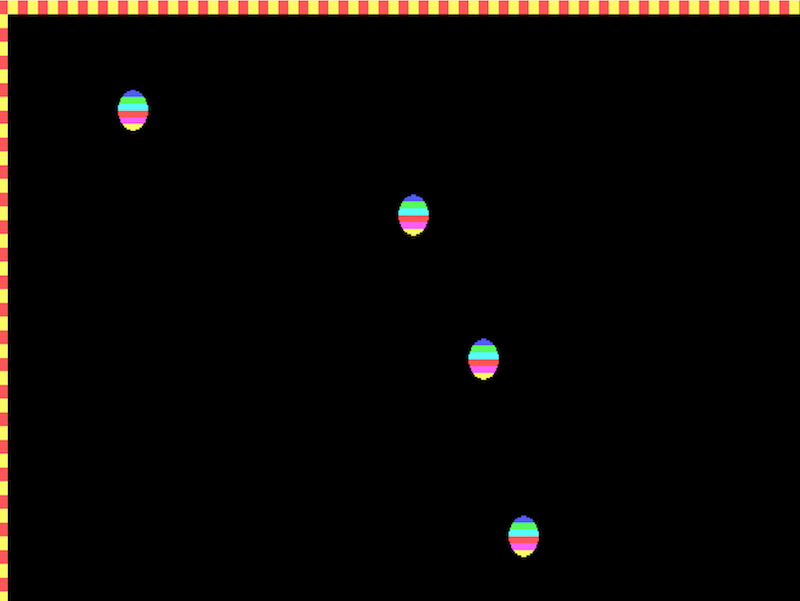
 * [Chapter 24: Parallel Processing with the VGA](https://github.com/jeffpar/abrash-black-book/blob/master/src/chapter-24.md)
	 * [L24-1.ASM: Illustrates operation of ALUs and latches of the VGA's Graphics Controller](L24-1.ASM) 
	 * 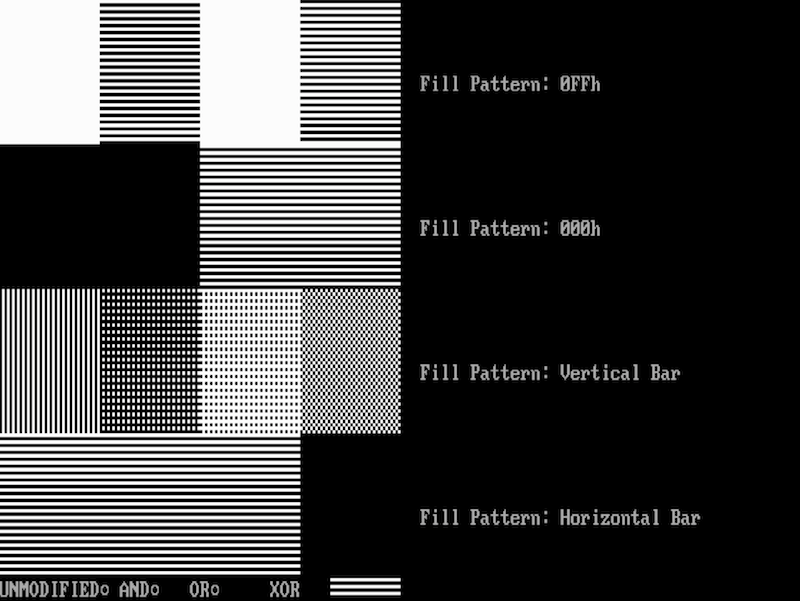
 * [Chapter 25: VGA Data Machinery](https://github.com/jeffpar/abrash-black-book/blob/master/src/chapter-25.md)
	 * [L25-1.ASM: Illustrates operation of data rotate and bit mask features of Graphics Controller](L25-1.ASM) 
	 * 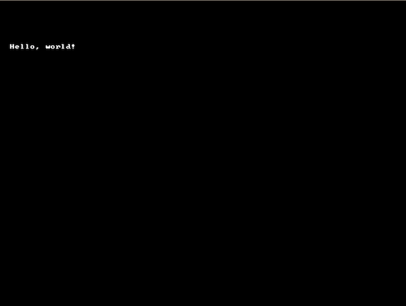 
	 * [L25-2.ASM: Illustrates operation of Map Mask register when drawing to memory that already contains data](L25-2.ASM) 
	 * 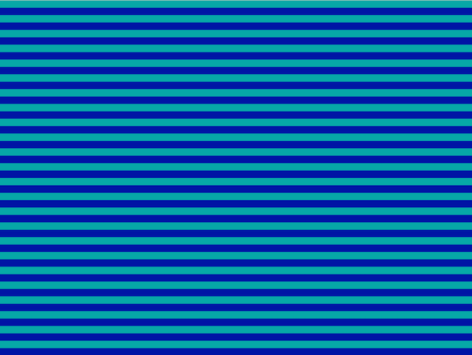 
	 * [L25-3.ASM: Illustrates operation of set/reset circuitry to force setting of memory that already contains data](L25-3.ASM) 
	 *  
	 * [L25-4.ASM: Illustrates operation of set/reset circuitry in conjunction with CPU data](L25-4.ASM) 
	 * 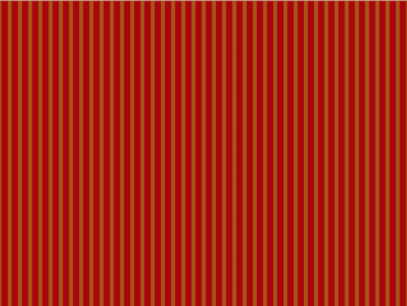 
 * [Chapter 26: VGA Write Mode 3](https://github.com/jeffpar/abrash-black-book/blob/master/src/chapter-26.md)
	 * [L26-1.ASM: Illustrates operation of write mode 3 of the VGA](L26-1.ASM) 
	 * 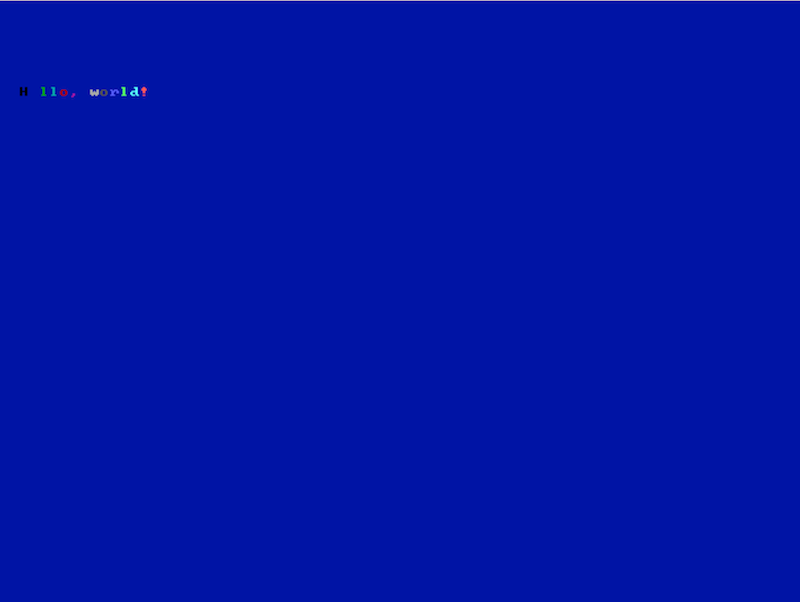 
	 * [L26-2.ASM: Illustrates high-speed text-drawing operation of write mode 3 of the VGA](L26-2.ASM) 
	 * 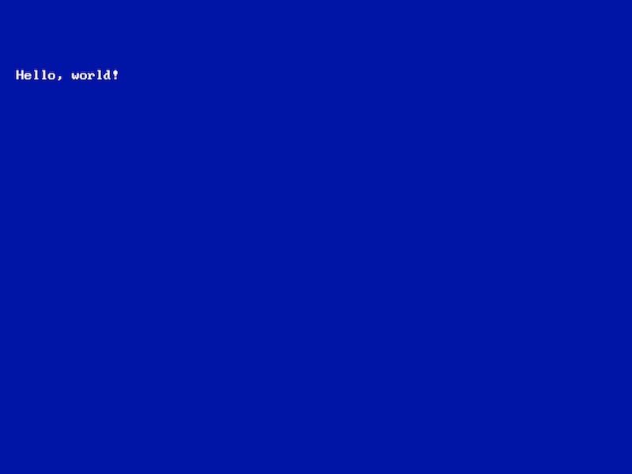 
 * [Chapter 27: Yet Another VGA Write Mode](https://github.com/jeffpar/abrash-black-book/blob/master/src/chapter-27.md)
	 * [L27-1.ASM: Illustrates one use of write mode 2 of the VGA and EGA by animating the image of an "A"](L27-1.ASM) 
	 *  
	 * [L27-2.ASM: Illustrates one use of write mode 2 of the VGA and EGA by drawing lines in color patterns](L27-2.ASM) 
	 * 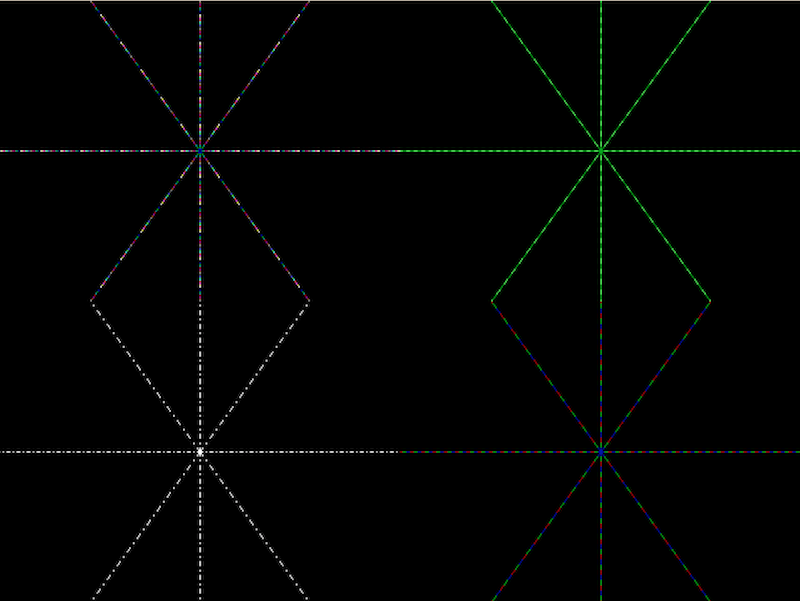 
	 * [L27-3.ASM: Illustrates flipping from bit-mapped graphics mode to text mode and back](L27-3.ASM) 
	 * 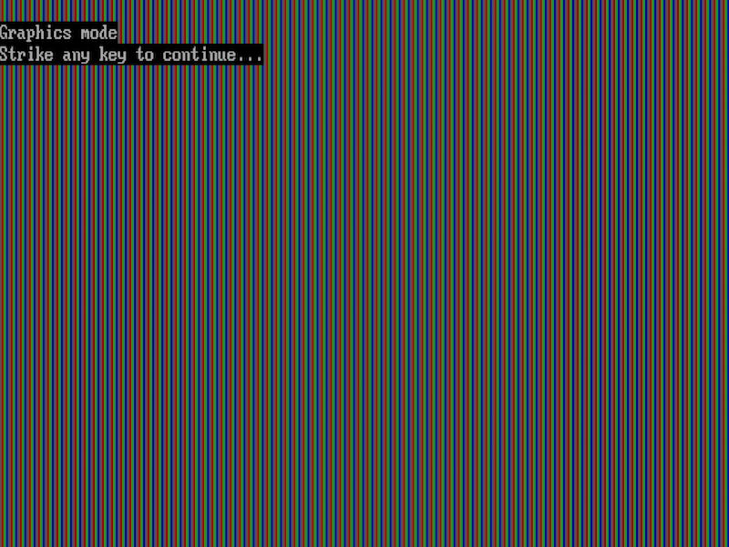 
	 * 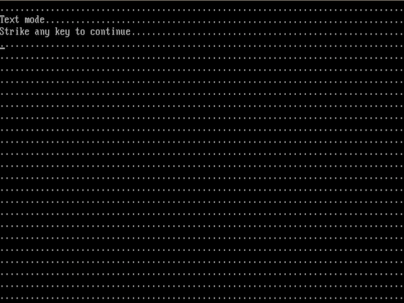 
	 *  
 * [Chapter 28: Reading VGA Memory](https://github.com/jeffpar/abrash-black-book/blob/master/src/chapter-28.md)
	 * [L28-1.ASM: Illustrates the use of the Read Map register in read mode 0](L28-1.ASM) 
	 * 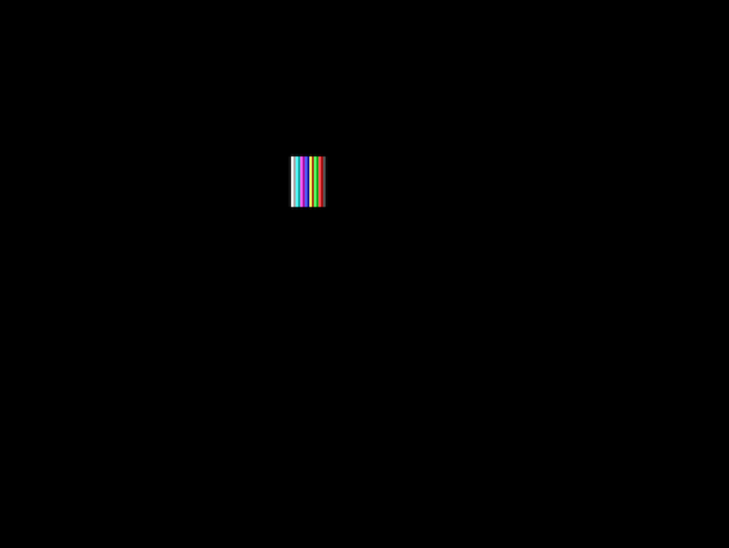 
	 * [L28-2.ASM: Illustrates use of read mode 1 (color compare mode) to detect collisions in display memory](L28-2.ASM) 
	 * 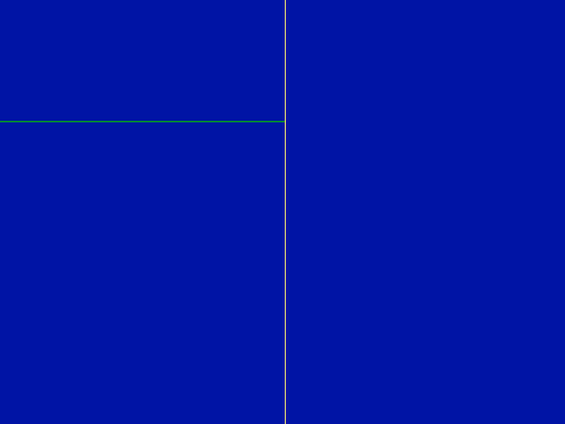 
	 * [L28-3.ASM: Illustrates the use of Color Don't Care to support fast read-modify-write operations](L28-3.ASM) 
	 *  
 * [Chapter 29: Saving Screens and Other VGA Mysteries](https://github.com/jeffpar/abrash-black-book/blob/master/src/chapter-29.md)
	 * [L29-1.ASM: Puts up a mode 10h EGA graphics screen, then saves it to the file SNAPSHOT.SCR](L29-1.ASM) 
	 * 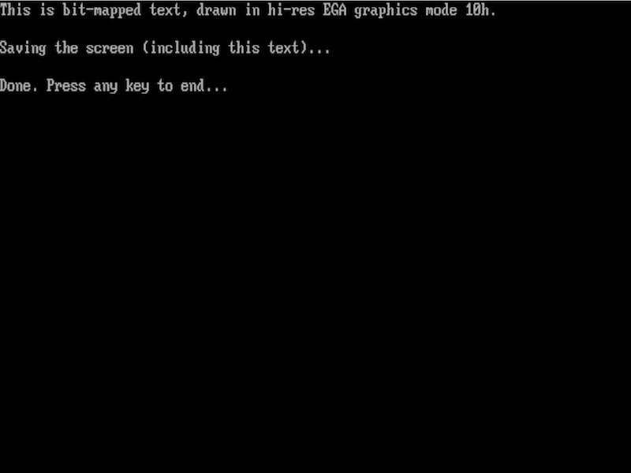 
	 * [L29-2.ASM: Restores a mode 10h EGA graphics screen from the file SNAPSHOT.SCR](L29-2.ASM) 
	 * 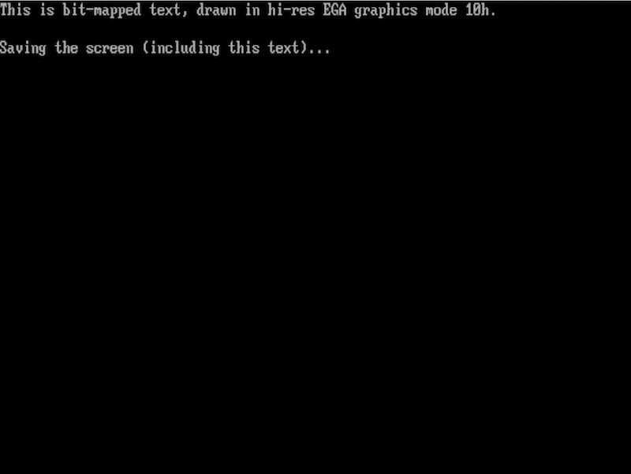 
	 * [L29-3.ASM: Illustrates the color mapping capabilities of the EGA's palette registers](L29-3.ASM) 
	 * 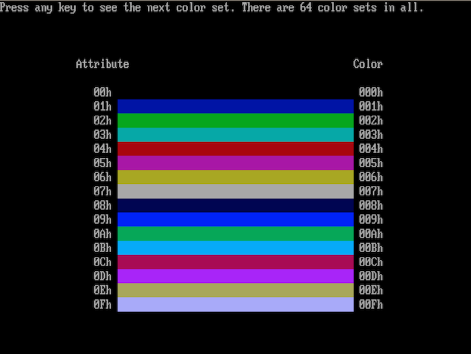 
	 * 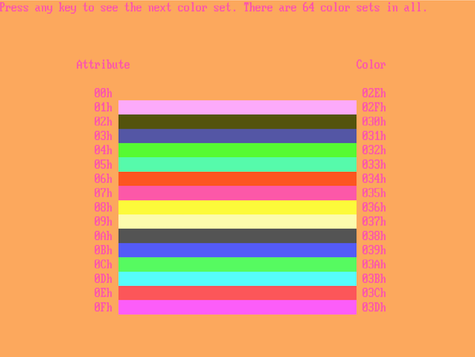 
	 * [L29-4.ASM: Demonstrates screen blanking via bit 5 of the Attribute Controller Index register](L29-4.ASM) 
	 * 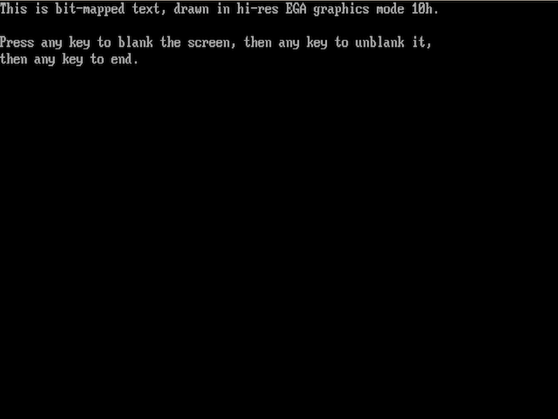 
 * [Chapter 30: Video Est Omnis Divisa](https://github.com/jeffpar/abrash-black-book/blob/master/src/chapter-30.md)
	 * [L30-1.ASM: Demonstrates the VGA/EGA split screen in action](L30-1.ASM) 
	 * [L30-2.ASM: Demonstrates the interaction of the split screen and horizontal pel panning](L30-2.ASM) 
 * [Chapter 31: Higher 256-Color Resolution on the VGA](https://github.com/jeffpar/abrash-black-book/blob/master/src/chapter-31.md)
	 * [L31-1.ASM: Demonstrates pixel drawing in 320x400 256-color mode on the VGA](L31-1.ASM) 
	 *  
	 * [L31-2.ASM: Demonstrates the two pages available in 320x400 256-color modes on a VGA](L31-2.ASM) 
	 * 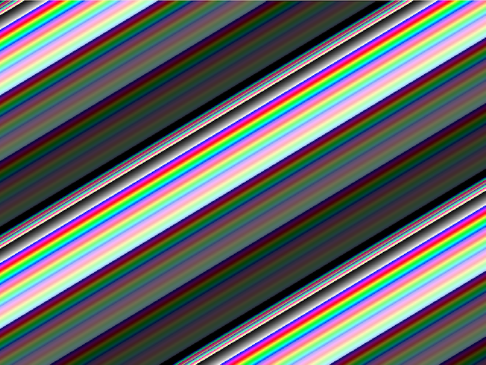 
	 * 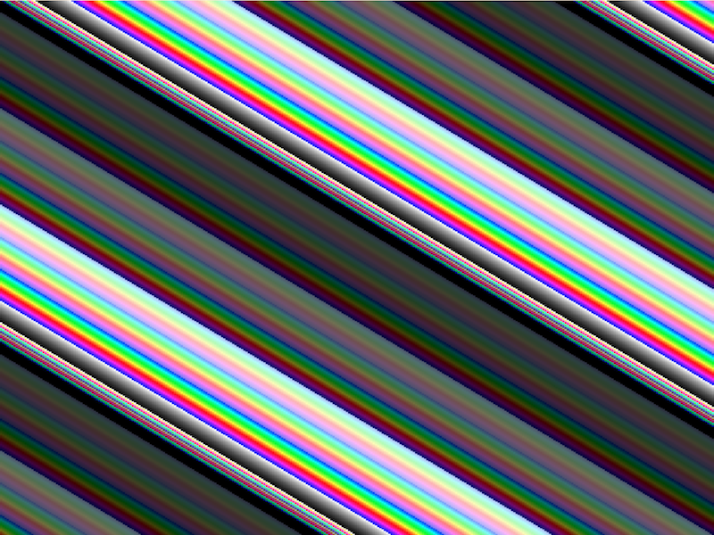 
	 * 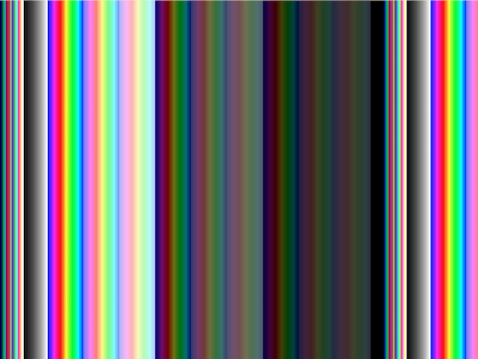 
 * [Chapter 32: Be It Resolved: 360x480](https://github.com/jeffpar/abrash-black-book/blob/master/src/chapter-32.md)
	 * [L32-1.ASM: Illustrates VGA line drawing in 360x480 256-color mode](L32-1.ASM) 
	 * [L32-2.C:   Sample program to illustrate VGA line drawing in 360x480 256-color mode](L32-2.C) 
 * [Chapter 33: Yogi Bear and Eurythmics Confront VGA Colors](https://github.com/jeffpar/abrash-black-book/blob/master/src/chapter-33.md)
	 * [L33-1.ASM: Demonstrates use of the DAC registers by selecting a smoothly contiguous set of 256 colors](L33-1.ASM)
	 * 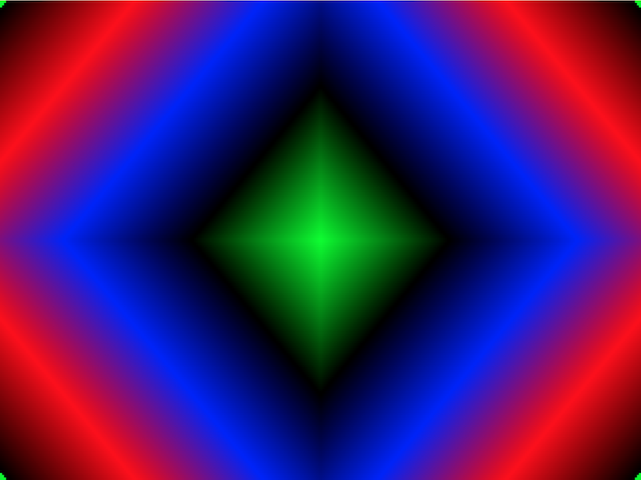 
 * [Chapter 34: Changing Colors without Writing Pixels](https://github.com/jeffpar/abrash-black-book/blob/master/src/chapter-34.md)
	 * [L34-1.ASM: Fills a band across the screen with vertical bars in all 256 attributes](L34-1.ASM)
	 * 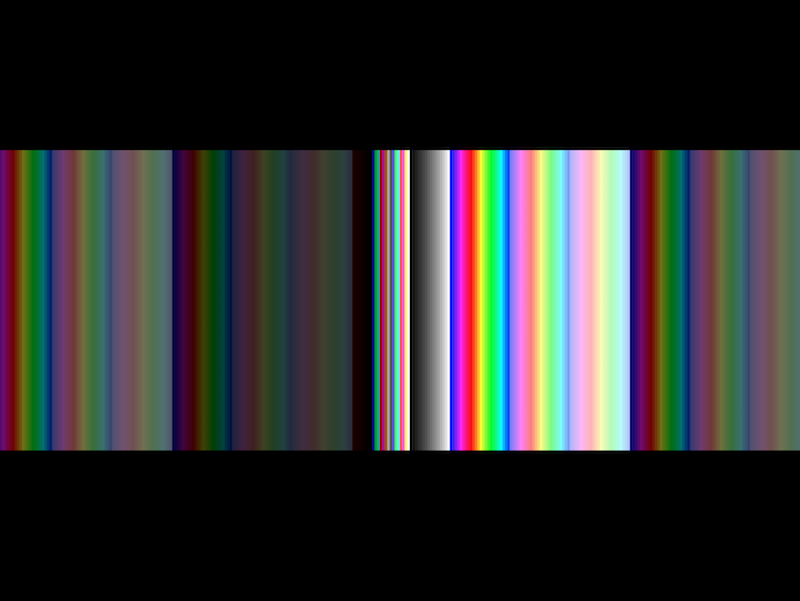 
 * [Chapter 35: Bresenham Is Fast, and Fast Is Good](https://github.com/jeffpar/abrash-black-book/blob/master/src/chapter-35.md)
	 * [L35-1.C: C implementation of Bresenham's line drawing algorithm](L35-1.C)
	 * 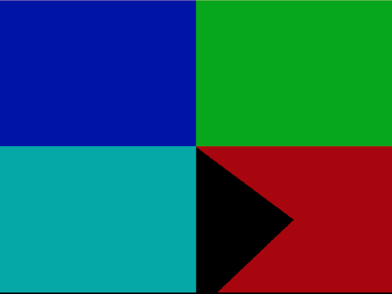 
	 * [L35-2.C: Sample program to illustrate EGA/VGA line drawing routines](L35-2.C)
	 * [L35-3.ASM: Fast assembler implementation of Bresenham's line drawing algorithm](L35-3.ASM)
 * [Chapter 47: Mode X: 256-Color VGA Magic](https://github.com/jeffpar/abrash-black-book/blob/master/src/chapter-35.md)
	 * [L47-1.ASM: Mode X (320x240, 256 colors) mode set routine](L47-1.ASM)
	 * [L47-2.ASM: Mode X (320x240, 256 colors) write pixel routine](L47-2.ASM)
	 * [L47-3.ASM: Mode X (320x240, 256 colors) read pixel routine](L47-3.ASM)
	 * [L47-4.ASM: Mode X (320x240, 256 colors) rectangle fill routine (slow)](L47-4.ASM)
	 * 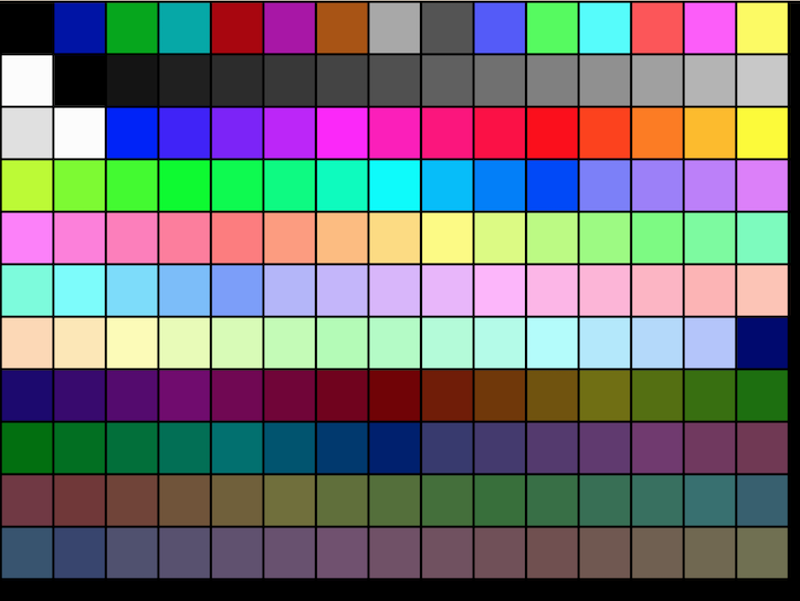 
	 * [L47-5.ASM: Mode X (320x240, 256 colors) rectangle fill routine (medium)](L47-5.ASM)
	 * [L47-6.ASM: Mode X (320x240, 256 colors) rectangle fill routine (fast)](L47-6.ASM)
	 * [L47-7.C: Program to demonstrate mode X (320x240, 256-colors) rectangle fill](L47-7.C)
 * [Chapter 48: Mode X Marks the Latch](https://github.com/jeffpar/abrash-black-book/blob/master/src/chapter-48.md)
	 * [L48-1.C: Mode X (320x240, 256 colors) patterned rectangle fills](L48-1.C)
	 * [L48-2.ASM: Mode X (320x240, 256 colors) rectangle 4x4 pattern fill routine](L48-2.ASM)
	 * 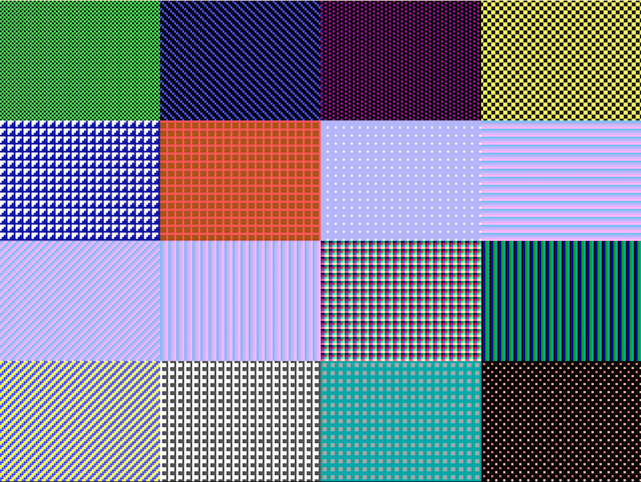 
	 * [L48-3.ASM: Mode X (320x240, 256 colors) display memory to display memory copy](L48-3.ASM)
	 * [L48-4.ASM: Mode X (320x240, 256 colors) system memory to display memory copy](L48-4.ASM)
